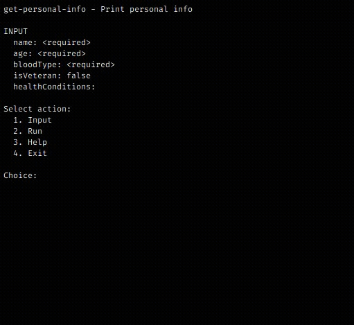

# LoopUI

Build CLI apps for the ordinary user

- TypeScript supported
- CommonJS (Node.js) supported
- ECMAScript Modules (ESM) supported



## Table of Contents

- [Why](#why)
- [Installation](#installation)
- [Example](#example)
- [Documentation](#documentation)
- [License](#license)

## Why

- CLI apps built on ``commander`` or ``yargs`` alone are great for developers and programs, but not
  so great for the ordinary user

- The ordinary user does not like having to figure out how to run a CLI app by iterative and
  error-prone typing such as:

  ```bash
  program -h
   # ... long output ...
  program cmd-a -h
   # ... more output ...
  program cmd-b -h
   # ... yet more output ...
  program cmd-b --flag --inpur="file.json" foo bar
    # Error: Unrecognized option --inpur (did you mean --input?)
  ```

  > A program can have many commands, args and opts... there must be a better way

- **LoopUI** applies the following design principles to make CLI apps more intuitive and usable:

  - _constraints_: at any given time options (affordances) are limited and obvious;
    the user knows what to do--no instructions needed

  - _feedback_: when an input is specified, the UI immediately reflects it

## Installation

```bash
npm i loopui
```

## Example

Building a **LoopUI** app is done in two easy steps:

1. Instantiate UI with necessary parameters
2. Start it

```ts
import { UI, Prompter, Caster, Validator } from "loopui";

Prompter.errorTimeoutMS = 1500; // set to 0 to disable error messages for faster UX

const ui = new UI({
  name: "get-personal-info",
  shortDescription: "Print personal info",
  longDescription: "Optionally include more details...\n\nExample:\n...",
  input: {
    name: {
      description: "Your name (ex: Ada)",
      validate: (value) => /^[A-Za-z]+([ -'][A-Za-z]+)*$/.test(value) // validates birth names
    },
    age: {
      description: "Your age (ex: 25)",
      cast: Caster.toNumber,
      validate: (value) => Validator.isNumber(value) && value > 0 && value < 130
    },
    bloodType: {
      description: "Your blood type (ex: A+)",
      choices: ["O+", "O-", "A+", "A-", "B+", "B-", "AB+", "AB-"]
    },
    isVeteran: {
      description: "Are you a veteran? (ex: true)",
      value: false,
      choices: [false, true]
    },
    healthConditions: {
      description: "A list of your health conditions (ex: diabetes,gout)",
      value: [],
      cast: Caster.toStringArray,
      validate: Validator.isStringArray
    }
  },
  run: (args) => {
    console.log(`\n${JSON.stringify(args, null, 2)}`);
  }
});

await ui.start();
```

## Documentation

The ``loopui`` package provides the following:

- **UI** - The main instantiable class, represents a user-interface
- **Prompter** - A static class, provides config & methods for getting input from user
- **Caster** - A static class, provides config & methods for converting input strings to other types
- **Validator** - A static class, provides basic methods for validating type of input after cast

Type definitions are included so if you have TypeScript and a decent IDE, auto-complete is your best
guide. Nevertheless, some detail is provided next.

### UI

This is the main class you'll need to instantiate and run. You pass in an object to the
constructor whose entries are:

> A ``?`` in the type description, that means the entry is optional

- ``name (string)``: The name of the CLI app as you'd like it to appear in the UI
- ``shortDescription (string)``: A one-liner explaining what the app does
- ``longDescription (string?)``: More detailed description of what the app does, shown on **Help**
- ``input (object)``: The entries of this object determine the prompt behavior on __Input__:
  - ``description (string)``: A one-liner explaining what the parameter does, shown on __Help__
  - ``value (Value?)``: Default value to use if user specifies nothing on prompt, if ``undefined``
    the prompter insists until a value is given
  - ``choices (Value[]?)``: If specified, the prompter will ask user to select one item from this
    list, otherwise the prompter will ask for user to enter value
  - ``cast (Function?)``: A function that casts a string to something else
  - ``validate: (Validate?)``: A function that returns boolean indicating whether value is valid

  > ``cast`` and ``validate`` are executed in series and in that order, i.e., if
  > both are specified, validate takes the value after it's been cast

  > if ``validate`` is specified and user provides an invalid value, the prompter insists

- ``run (Function)``: A function that does something with the input the user's entered, hence it
  must take ``args``, a simple key-value pair object containing user input

### Prompter

**Fields**

- ``errorTimeoutMS (number)``: Duration of pause and error display in milliseconds, defaults to some
  reasonable value

**Methods**

- ``continue``: Prompts user to press any key to continue
- ``ask``: Prompts user for a value, optionally cast and validate it, then returns it
- ``select`` Prompts user to select an item from a list

### Caster

**Fields**

- ``separator (string)``: String to use as separator when casting to array types, defaults to ``,``

**Methods**

- ``toStringArray``: ``"Ada Lovelace,Bob Smith" => ["Ada Lovelace", "Bob Smith"]``
- ``toNumber``: ``"100" => 100``
- ``toNumberArray``: ``"1,2,3.4,foo" => [1, 2, 3.4, NaN]``
- ``toBoolean``: ``"False" => false``
- ``toBooleanArray``: ``"FALSE,0,true,TrUe,1,word" => [false, false, true, true, true, true]``

### Validator

**Methods**

- ``isString``
- ``isStringArray``
- ``isNumber``
- ``isNumberArray``
- ``isBoolean``
- ``isBooleanArray``

## License

[MIT](LICENSE) License
